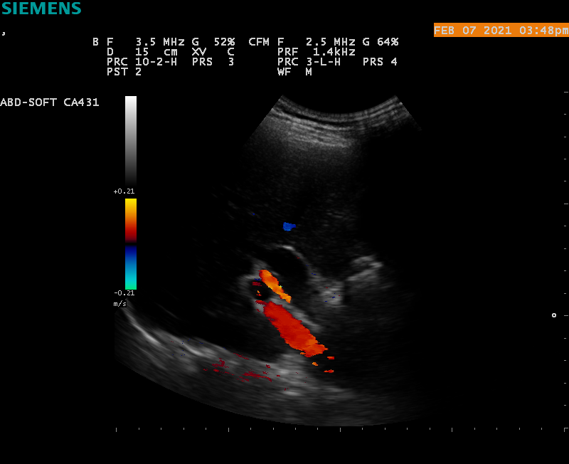
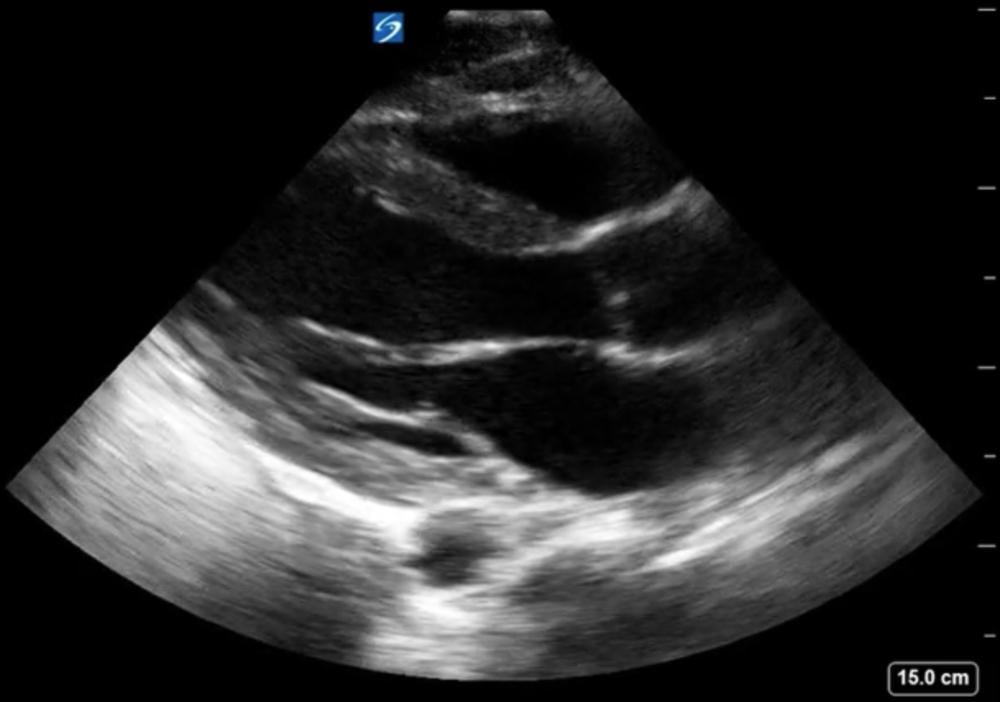
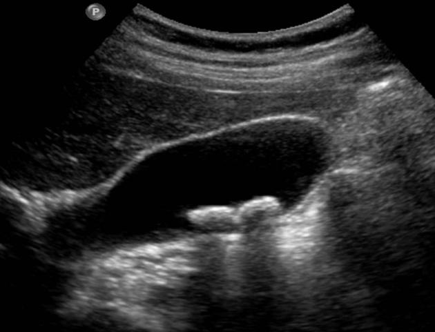

# POCUS 知識測驗（前測）

1. 請問這張圖使用到超音波的什麼mode？ 
   1. A mode
   2. B mode
   3. Color doppler mode
   4. M Mode
2. 請問這張圖使用到超音波的什麼mode？ 
   1. A mode
   2. B mode
   3. Color doppler mode
   4. M Mode
3. 請問這張圖使用到超音波的什麼mode？ 
   1. A mode
   2. B mode
   3. Color doppler mode
   4. M Mode
4. 請問下列哪一種探頭最適合用來觀察表淺構造？
   1. Linear probe 
   2. Curvilinear probe 
   3. Phased array probe 
5. 下列何者後方不容易出現聲影(acoustic shadow)
   1. 軟骨
   2. 腸氣
   3. 脊椎
   4. 結石
6. 在超音波看到如下圖之白色區域，最不可能是什麼構造？ 
   1. Stone
   2. Bone
   3. Blood
   4. Air
7. 請問下圖是心臟超音波的什麼view？ 
   1. parasternal long axis view
   2. parasternal short axis view
   3. apical four-chamber view
   4. subxyphoid four-chamber view
8. 請問下圖是心臟超音波的什麼view？ 
    1. parasternal long axis view
    2. parasternal short axis view
    3. apical four-chamber view
    4. subxyphoid four-chamber view
9. 請問下圖是心臟超音波的什麼view？ 
    1. parasternal long axis view
    2. parasternal short axis view
    3. apical four-chamber view
    4. subxyphoid four-chamber view
10. 心臟超音波得到的影像如下圖，臨床上應懷疑什麼？ 
    1. 主動脈剝離
    2. 肺栓塞
    3. 心肌梗塞
    4. 心包填塞
11. 心臟超音波得到的影像如下圖，臨床上應懷疑什麼？ 
    1. 腹腔積液
    2. 肺栓塞
    3. 心包膜積液
    4. 胸腔積液
12. 下圖為一胸腔超音波檢查的影像，請問白色箭頭所指的發現是？  
    1. A lines
    2. B lines
    3. Barcode sign
    4. Seashore sign
13. 下圖為一胸腔超音波檢查的影像，請問白色箭頭所指的發現是？ 
    1. A lines
    2. B lines
    3. Barcode sign
    4. Seashore sign
14. 下圖為一胸腔超音波檢查的影像，請問白色方框處的發現是？ 
    1. A lines
    2. B lines
    3. Barcode sign
    4. Seashore sign
15. 下列哪一項胸腔超音波檢查的發現可以***確認***該處氣胸的存在？
    1. A lines
    2. B lines
    3. Barcode sign
    4. Lung point
16. 下列哪一項胸腔超音波檢查的發現可以***排除***該處氣胸的存在？
    1. A lines
    2. B lines
    3. Barcode sign
    4. Lung point
17. 請解釋這張超音波的發現？ 
    1. 腎結石
    2. 膽囊炎
    3. 脾臟腫大
    4. 腎水腫
18. 請解釋這張超音波的發現？ 
    1. 腎結石
    2. 輸尿管結石
    3. 膽結石
    4. 腎水腫
19. 請解釋這張超音波的發現？ 
    1. 腎水腫
    2. 脾腫大 
    3. 腹腔積液
    4. 胸腔積液
20. 下列哪一張超音波為可以看見置入導尿管的膀胱，且導尿管正常運作？
    1. 
    2. 
    3. 
    4. 
21. 下列哪一項非急性膽囊炎常伴隨的超音波檢查發現？
    1. 膽囊壁中層伴隨高回音
    2. 膽結石
    3. 膽囊周遭出現積液
    4. 膽囊壁變厚
22. 請問圖上量測的構造是什麼？ 
    1. 主動脈
    2. 下腔靜脈
    3. 肝靜脈
    4. 肝門靜脈
23. 請解釋這張超音波的發現？ 
    1. 腎水腫
    2. 脾腫大 
    3. 腹腔積液
    4. 胸腔積液
24. 下圖為右上腹超音波影像，請問圖中白色箭頭所指的構造是什麼？ 
    1. 總膽管
    2. 肝動脈
    3. 肝靜脈
    4. 肝門靜脈
25. 平躺狀態下，腹腔積液最不可能出現在哪裡？
    1. 肝腎隱窩 (Morrison’s pouch)
    2. 膀胱附近 (perivesical space)
    3. 脾腎隱窩 (splenorenal fossa)
    4. 肝臟的裸區 (bare area of the liver)
